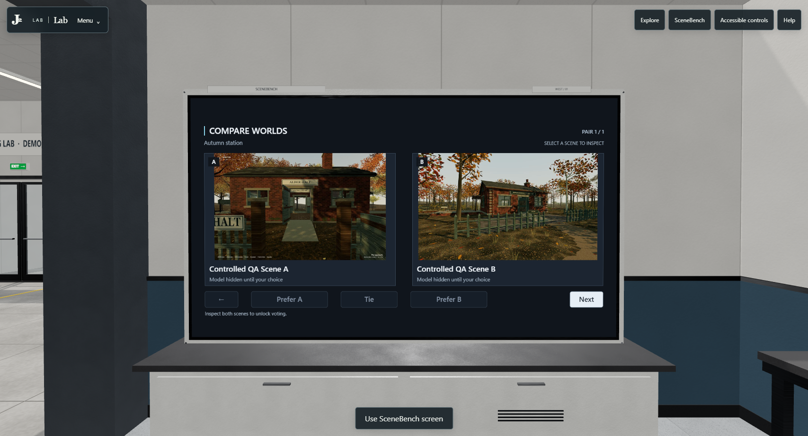
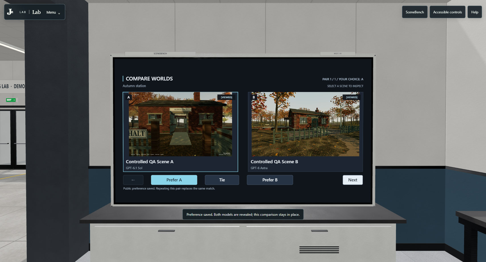
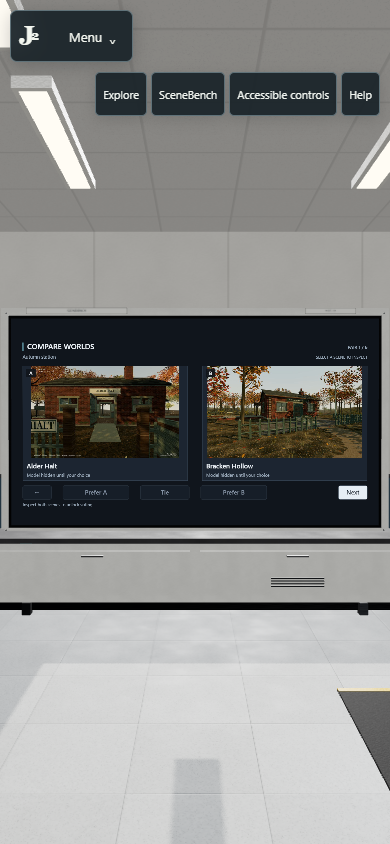
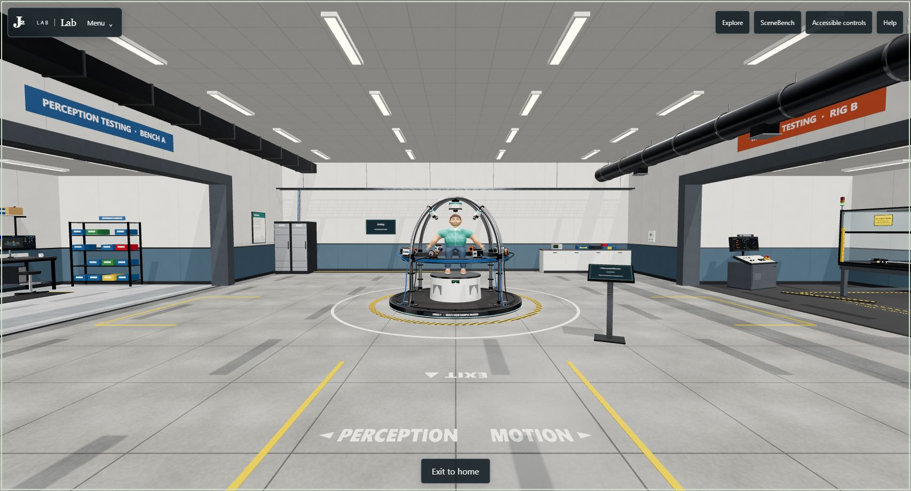

# Physical SceneBench display

SceneBench now uses the actual west Lab display as its default interface.
Click either scene card to enter the existing full-screen inspector in the same
tab. Exiting restores the standing screen pose, ordered A/B pair, comparison
identity and ready receipts. After both scenes are viewed, vote directly on the
display; Next starts a fresh blind comparison while retaining saved choices.
The Lab renderer remains active for vote and Next and is disposed for inspection.

The header, menu, nearby shortcut and Help's SceneBench action focus the display.
Blank regions, the bezel and missed rays do nothing. There is no automatic
comparison dialog. **Accessible controls** deliberately opens the existing
keyboard-friendly panel, leaderboard and grading controls. If rendering fails,
the menu retains its direct SceneBench destination. Narrow navigation occupies
its own row below the masthead and remains inside the safe-area margins.

The physical station keeps its west location, screen size, UV mapping and clear
floor footprint. Pale fitted housing, white storage doors, steel pulls, recessed
vents and small equipment identifiers replace the heavy black surround. Its
screen uses graphite/slate surfaces, sans-serif typography, contained preview
cards, A/B and viewed badges, and restrained cyan selection accents. It adds no
dynamic light or postprocessing effect.

The selected-preference capture uses a locally intercepted mock submission.
No public vote or character ranking is represented by this image.

Final source is `05db8f5173d969a93babc5ead1329c96b5628ed6`. The direct-click capture
used its preceding `3a12def` source; the only subsequent runtime change is the
portrait CSS repair. JavaScript, geometry, interaction targets and the generated
renderer are identical. Final validation passed 153 CPU cases, 1,000 frozen-file
integrity checks and voting parity for all 89 catalog records. Independent code
review passed 91 CPU cases and reproduced the renderer bundle byte for byte;
separate still-image and narrow-CSS reviews found no material issues.

Two serialized headless Chrome sessions verified actual canvas ray targets and
native clicks, full-screen scene departure, both ready receipts, safe returns,
disabled voting after one scene, mocked vote/reveal, Next, inert whitespace and
explicit accessibility access. Camera orientation was set through the QA pose
hook before clicking, to avoid headless relative-cursor warps; the real renderer,
ray and native canvas events performed the action. No direct comparison-method
calls or synthetic DOM clicks were used. Submitted scene documents were replaced
with integrity-checked controlled fixtures; no benchmark entrant executed.
Final entrance and portrait stills use the unchanged real catalog and public
JPEG previews. All nonlocal requests were blocked and both write requests were
intercepted. Neither final session recorded an application or QA error.

At 1707 x 923 / DPR 1, a five-second captured sample on the RTX 5070 Ti Laptop GPU
recorded 1,201 RAF intervals: median 4.2 ms, p95/p99 4.3 ms, none over 25 ms.
That screen view submitted 49 draw calls and 11,948 triangles. These are headless
scheduling measurements, not displayed FPS, GPU duration or measured improvement
against the frozen scene. The sampled document's startup recorded 642 ms and
337 ms long tasks. Physical touch and submitted-scene rendering were not tested.

At 390 x 844 and 320 x 700, measured button bounds show no masthead intersection
or off-screen controls. Native SceneBench and Accessible controls actions worked.
The board's microcopy is small at 320px; the explicit panel provides larger text.

The unedited 1707 x 923 entrance JPEG is 171,898 bytes, SHA-256
`9379003c054b3daa59886b3b6b46d9c8999646388eeabc97b4ca460efd7cc17b`.
Supply it to the homepage owner for the Lab entrance image and manifest before
coordinated publication. The entrance pose and existing `default-entry-v2`
bootstrap contract remain compatible. This draft changes no homepage producer,
access, sharing, credential, voting backend or private Studio asset.

The entire SceneBench tree, frozen Claude source, catalog, CharacterBench route,
public Ivo model, data and infrastructure trees match the PR64 base. Exact
hashes, source states, captures and limitations are in
[LAB-PHYSICAL-SCENEBENCH-EVIDENCE.json](LAB-PHYSICAL-SCENEBENCH-EVIDENCE.json).
All owned Chrome browsers and local QA servers are closed; both ports and PIDs
were confirmed absent. The separate Library preview at 5418 was untouched.
This follow-up has not been merged or deployed.
